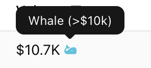
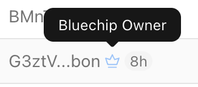

# ⚡ Quick Start

## 1. Discover Trending Tokens

- Click to Trending 👉 [https://dextracker.pro/trending](https://cryptoscan.pro/trending)
- Or search token by `Search token or address...` button on the header
- Set sorting and filters for myself. It will save on your browser for the next time.

| Tag                                  | Explanation                                                                                                                                                                                                                                                                        |
| -------------------------------------- | ---------------------------------------------------------------------------------------------------------------------------------------------------------------------------------------------------------------------------------------------------------------------------------- |
|  |  Bluechip tokens are cryptocurrencies that are considered high-quality, reliable, and well-established, much like blue-chip stocks in traditional finance.   **Problem:** High risk from only holding low-quality tokens.  **Solution:** Encourages holding trusted assets → improves portfolio safety and credibility. |
|  | Percentage of all tokens bought by TOP10 traders.  **Problem:** Top holders may only hold risky or low-quality tokens → fake volume, poor portfolio health.  **Solution:** Encourages top holders to also hold trusted assets → increases trust, reduces manipulation. |
|        | Number of sniper bots that bought the token in the first few blocks after launch.  **Problem:** High sniper activity can indicate a bot-dominated or manipulated launch.  **Solution:** Helps identify unnatural interest early on → better risk assessment before entering. |
|  | Number of known "smart wallets" (profitable or high-reputation wallets) buying the token.  **Problem:** Lack of smart money may suggest low-quality or unvetted project.  **Solution:** Tracks entry of smart actors → encourages following knowledgeable investors.         |
|             | Net difference between token buys and sells in the last 1 minute.  **Problem:** Sudden sell pressure can indicate incoming dumps or rug pulls.  **Solution:** Real-time net flow helps monitor sentiment shifts → enables quick reaction.                                    |
|           | Indicates a coordinated buy from multiple wallets (bundle/multi-wallet strategy).  **Problem:** Hidden coordination or manipulation via split wallets.  **Solution:** Reveals cluster behavior → transparency into real buyer intent.                                        |
|  | List of centralized and decentralized exchanges where the token is currently traded.  **Problem:** Token may be illiquid or only available on obscure platforms.  **Solution:** Shows where trading is possible → helps assess accessibility, trust, and volume quality. |
|     | List of blockchains (e.g., Ethereum, Solana, Tron, BNB Chain) where the token exists.  **Problem:** Multichain tokens can fragment liquidity or confuse users.  **Solution:** Displays full chain presence → helps understand liquidity distribution and bridging risks.       |

## 2. Check Price Chart and Transactions Analysis

- **Transaction Analysis**

Analyze transaction to find smart actions, buy or sell early and smarter than anyone.

| Tag                                   | Explanation                                                                                                                                                                                                                                                                                         |
| --------------------------------------- | --------------------------------------------------------------------------------------------------------------------------------------------------------------------------------------------------------------------------------------------------------------------------------------------------- |
|  | Shows the profit or loss (PnL) of a wallet from trading this token (realized + unrealized).  **Problem:** Unknown wallet performance can hide smart/dumb money behavior.  **Solution:** Helps identify whether top holders are winning or losing → useful for following or fading them. |
|  | Percentage of total bought tokens that have already been sold (lifetime). Hover shows total \$ bought vs sold.  **Problem:** High percentage sold may suggest early exit, lack of conviction, or fading hype.  **Solution:** Reveals long-term sell pressure → helps judge holder confidence. |
|     | Wallets that bought less than \$1 worth of tokens.  **Problem:** Excessive flea activity may indicate airdrop farming or spam-like behavior.  **Solution:** Helps filter out noise → focuses analysis on meaningful buyers.                  |
|   | Wallets that bought less than \$1,000 worth of tokens.  **Problem:** Dominance of small retail buyers may signal low conviction or speculative hype.  **Solution:** Useful to gauge retail participation vs larger investor interest.        |
|     | Wallets that bought more than \$1,000 worth of tokens.  **Problem:** Lack of mid-size buyers may indicate missing organic interest.  **Solution:** Shows if the token is attracting serious, but not over-leveraged, capital.                |
|  | Wallets that bought more than \$3,000 worth of tokens.  **Problem:** If absent, may suggest token lacks confidence from mid-high range buyers.  **Solution:** Tracks moderate-cap investors → gives early sign of institutional curiosity.   |
|    | Wallets that bought more than \$10,000 worth of tokens.  **Problem:** No whale entries may mean low confidence or low potential.  **Solution:** Whales can signal strong conviction and smart money → valuable for identifying serious bets. |

- **Wallet analysis**

Analyze wallet to detect price manipulator or smart wallet.

| Tag                                    | Explanation                                                                                                                                                                                                                                                   |
| ---------------------------------------- | ------------------------------------------------------------------------------------------------------------------------------------------------------------------------------------------------------------------------------------------------------------- |
|    | Wallet holds recognized bluechip tokens.  **Problem:** Hard to judge wallet quality at a glance.  **Solution:** Signals that the wallet holds trusted assets → suggests experience or selectivity.                                                      |
|      | Wallet is identified as a sandwich bot based on transaction patterns.  **Problem:** Sandwich bots distort price and harm real traders.  **Solution:** Flags potentially harmful MEV actors → helps avoid misleading transaction signals.                |
|      | Wallet was created recently (e.g., last 7 days).  **Problem:** Fresh wallets are often used for farming, manipulation, or throwaway trades.  **Solution:** Adds context about wallet's credibility → helps filter low-trust activity.                   |
|  | Shows how long the wallet held the token before selling (or current holding duration).  **Problem:** Without time context, it’s hard to know if a wallet is flipping or investing.  **Solution:** Holding time reveals conviction or bot-like behavior. |

- **Price Difference analysis**

Analyze price difference on each market to detect what side price will go earlier than anyone.

| Image                                | Explanation                                                                                                                                                                                                                                                              |
| ------------------------------------ | ------------------------------------------------------------------------------------------------------------------------------------------------------------------------------------------------------------------------------------------------------------------------ |
|   | Exchange marked with a green border is the **active exchange** — the main reference point for price comparison.  **Problem:** Without a consistent base, spread data is ambiguous.  **Solution:** Clarifies which price is used as baseline for all spread checks. |
|  | Percentage difference between token price on this exchange vs the active one.  **Problem:** Arbitrage or latency can mislead users on true price direction.  **Solution:** Highlights where price is lagging or leading → helps detect early price movement.       |
|     | Estimated dollar value **inside the spread** (e.g., liquidity gap between exchanges).  **Problem:** Percent spread alone doesn't show trade opportunity size.  **Solution:** Reveals how much money is “sitting” between price gaps → useful for real arbitrage.   |

## 3. Connect Phantom/Solflare wallet

Click on **Connect Wallet** button

Choose wallet that supports Solana Network

## 4. Swap on DexTracker.pro

- Type amount of tokens that you want to buy or tokens that you have.
- Platform supports trade with any coins SOL, USDT, USDC and any other, you want.
- You can choose exchange, where you want to trade or remove active exchange to aggregate a price automatically
- Price will update automatically.
- **Be careful, transaction fees in SOL. You need to have enough SOL for transaction.**

- **Max Slippage** - price can change before your transaction approved. Slippage is a percentage of allowed price change before you swapped token.
Recommendation: 5-6%
- **Priority Fee** - how's fast transaction will approved by the blockchain, you can add extra sol to make approve faster

## 5. Integrate DexTracker API and Auto Trading with Script

Learn more on [API Docs](./DexTracker%20API/)

## ⚠️ Disclaimer

**Token security information and on-chain transaction data provided by GMGN are sourced from multiple third-party providers. They are provided for reference only and should not be considered investment advice. Token trading involves risks, so it is essential to conduct independent research and consider all potential risks. GMGN does not assume any responsibility for related issues.**
